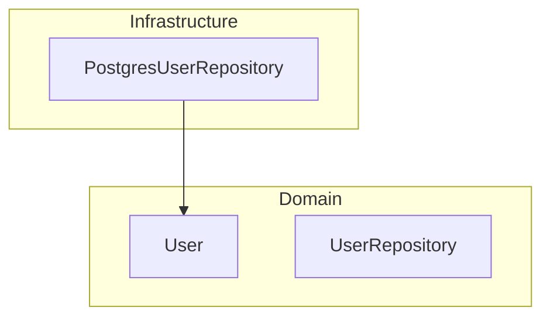
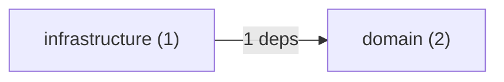

# Architecture Diagrams

Boundary can generate architecture diagrams in Mermaid and GraphViz DOT formats, showing how
components are organized into layers and how they depend on each other.

```bash
boundary diagram <PATH> [--diagram-type <TYPE>]
```

---

## Diagram Types

| Type                | Format      | Description |
|---------------------|-------------|-------------|
| `layers` (default)  | Mermaid     | Components grouped into layer subgraphs with dependency edges |
| `dependencies`      | Mermaid     | Simplified layer-to-layer dependency flow with edge counts |
| `dot`               | GraphViz    | Same as `layers` in DOT format |
| `dot-dependencies`  | GraphViz    | Same as `dependencies` in DOT format |

---

## Mermaid Layer Diagram

Shows each real architectural component inside its layer subgraph. Dependency edges are drawn
between components; edges that violate layer boundaries are marked as violations.

```bash
boundary diagram .
boundary diagram . --diagram-type layers
```

Example output:



Violation edges are rendered with a dashed arrow and a `violation` label:

```mermaid
  domain__user_User -.->|"infra/postgres (violation)"| infra__postgres_PostgresUserRepository
```

> **Note:** Only real named components (structs, interfaces, classes) appear in diagrams.
> Synthetic graph nodes used for internal dependency tracking (`<file>`, `<package>`) are
> automatically filtered out.

### Rendering

Paste the output into any Mermaid-compatible renderer:

- [mermaid.live](https://mermaid.live) — instant online preview
- GitHub Markdown — wrap in a ` ```mermaid ` code block
- VS Code — Mermaid Preview extension

---

## Mermaid Dependency Flow

A higher-level view showing layer-to-layer edges with dependency counts, useful for quickly
spotting which layers are talking to each other and where violations are concentrated.

```bash
boundary diagram . --diagram-type dependencies
```

Example output:



---

## GraphViz DOT Diagrams

The `dot` and `dot-dependencies` types produce GraphViz DOT output. Pipe to `dot` to render
as an image:

```bash
# Render as PNG
boundary diagram . --diagram-type dot | dot -Tpng -o architecture.png

# Render as SVG
boundary diagram . --diagram-type dot-dependencies | dot -Tsvg -o flow.svg

# Save DOT source for later
boundary diagram . --diagram-type dot > architecture.dot
```

Layer subgraphs use colour-coded backgrounds:

| Layer          | Background Colour |
|----------------|------------------|
| Domain         | `#e8f5e9` (green tint) |
| Application    | `#e3f2fd` (blue tint) |
| Infrastructure | `#fff3e0` (amber tint) |
| Presentation   | `#fce4ec` (pink tint) |

---

## CI Integration

Generate and commit diagrams as part of a CI workflow:

```yaml
- name: Update architecture diagram
  run: boundary diagram . > docs/architecture.mmd
```

Or use the diagram as a visual diff in pull requests by generating it and including it in PR
descriptions.
